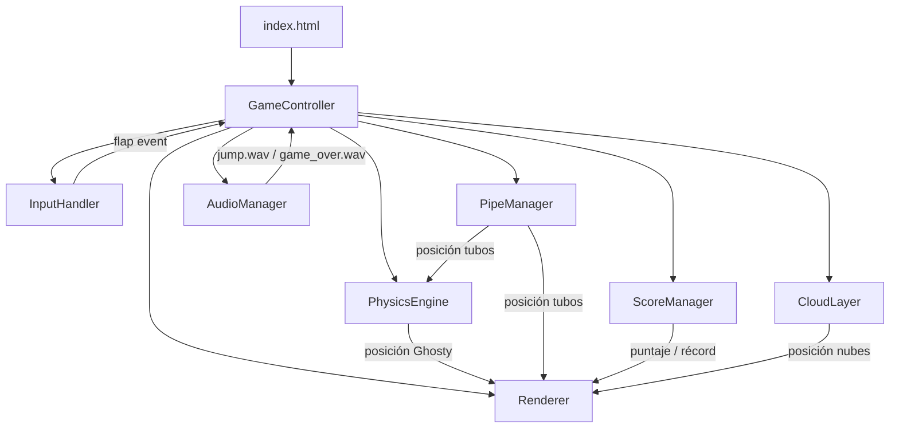
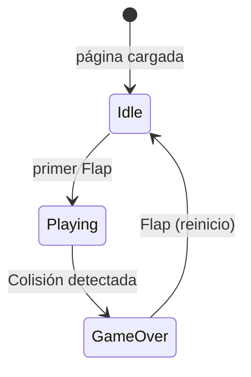

# Documento de Diseño Técnico — Flappy Kiro

## Visión General

Flappy Kiro es un juego de desplazamiento infinito que corre íntegramente en el navegador, implementado con HTML5 Canvas, CSS y JavaScript puro (sin frameworks ni backend). El jugador controla a Ghosty, un fantasma que debe esquivar una serie infinita de pares de tubos verdes mientras la gravedad lo jala hacia abajo. El juego soporta entrada por teclado, ratón y táctil, se adapta a cualquier tamaño de pantalla y persiste el récord histórico en `localStorage`.

### Objetivos de diseño

- **Sin dependencias externas**: todo el código reside en un único archivo `index.html` que referencia solo activos locales.
- **Configuración centralizada**: todos los valores numéricos y colores viven en un único objeto `CONFIG` al inicio del script. Ningún componente usa números mágicos.
- **Bucle de juego determinista**: física basada en delta-time para comportamiento consistente independientemente de la tasa de fotogramas.
- **Separación de responsabilidades**: cada subsistema (física, tubos, puntaje, audio, renderizado) es un módulo independiente que lee de `CONFIG`.
- **Responsividad total**: todos los valores de física y geometría se derivan de las dimensiones del viewport para que la experiencia sea idéntica en móvil y escritorio.

---

## Configuración Centralizada (CONFIG)

Todos los valores configurables del juego se definen en un único objeto `CONFIG` al inicio del bloque `<script>`. Cada componente lee de `CONFIG` en lugar de usar números mágicos. Para ajustar cualquier parámetro del juego, solo hay que modificar este objeto.

```javascript
const CONFIG = {
  physics: {
    gravityRatio:      0.0018,  // gravedad = viewportHeight * gravityRatio  (px/ms²)
    flapImpulseRatio:  0.45,    // impulso  = viewportHeight * flapImpulseRatio (px/ms)
    terminalVelRatio:  0.80,    // vel. terminal = viewportHeight * terminalVelRatio (px/ms)
  },
  pipes: {
    count:             4,
    spacingRatio:      0.45,    // espaciado mínimo = viewportWidth * spacingRatio
    widthRatio:        0.10,    // ancho tubo = viewportWidth * widthRatio
    baseSpeedRatio:    0.0003,  // velocidad base = viewportWidth * baseSpeedRatio (px/ms)
    speedIncrement:    0.02,    // factor de incremento de velocidad por punto (2%)
    gapBaseRatio:      0.38,    // hueco base = viewportHeight * gapBaseRatio
    gapMinRatio:       0.22,    // hueco mínimo = viewportHeight * gapMinRatio
    gapReductionRatio: 0.015,   // reducción por reciclaje = viewportHeight * ratio
    gapReductionProb:  0.30,    // probabilidad de reducir el hueco al reciclar (30%)
  },
  clouds: {
    count:             6,
    minOpacity:        0.3,
    maxOpacity:        0.8,
    minSpeedRatio:     0.00005, // nube lenta  = viewportWidth * minSpeedRatio (px/ms)
    maxSpeedRatio:     0.00015, // nube rápida = viewportWidth * maxSpeedRatio (px/ms)
    minWidthRatio:     0.08,    // ancho mínimo nube = viewportWidth * ratio
    maxWidthRatio:     0.18,    // ancho máximo nube = viewportWidth * ratio
    heightRatio:       0.06,    // alto nube = viewportHeight * ratio
    borderRadius:      12,      // px fijos para el redondeo de esquinas
  },
  ghosty: {
    xRatio:            0.30,    // posición X fija = viewportWidth * xRatio
    sizeRatio:         0.07,    // tamaño (ancho y alto) = viewportHeight * sizeRatio
    collisionInset:    0.20,    // reducción del bounding box (20% por lado)
    bobAmplitude:      0.015,   // amplitud del balanceo idle = viewportHeight * ratio
    bobFrequency:      0.002,   // frecuencia del balanceo idle (ciclos/ms)
  },
  colors: {
    sky:               '#87CEEB',
    pipeBody:          '#4CAF50',
    pipeBorder:        '#2E7D32',
    scoreBar:          '#1a1a2e',
    scoreText:         '#FFFFFF',
    overlayBg:         'rgba(0, 0, 0, 0.45)',
    overlayText:       '#FFFFFF',
    cloud:             'rgba(255, 255, 255, 1)', // opacidad se aplica por nube
  },
  ui: {
    scoreBarHeight:    48,       // px fijos
    fontFamily:        'monospace',
    scoreFontSize:     22,       // px fijos
    overlayFontSize:   0.06,     // tamaño overlay = viewportHeight * ratio
  },
  storage: {
    highScoreKey:      'flappyKiroHigh',
  },
  loop: {
    maxDeltaTime:      50,       // ms máximo por frame para evitar saltos de física
    resizeDebounce:    100,      // ms de debounce para el handler de resize
  },
};
```

---

## Arquitectura

El juego sigue una arquitectura de **bucle de juego con módulos coordinados por un controlador central**. No hay servidor; toda la lógica vive en el cliente dentro de un único archivo HTML.



### Máquina de estados del juego



### Bucle de juego

El bucle principal usa `requestAnimationFrame`. En cada fotograma:

1. Calcular `deltaTime` (ms desde el fotograma anterior, limitado a `CONFIG.loop.maxDeltaTime`).
2. Actualizar física de Ghosty (`PhysicsEngine`).
3. Actualizar posición de tubos (`PipeManager`).
4. Actualizar posición de nubes (`CloudLayer`).
5. Detectar colisiones.
6. Actualizar puntaje (`ScoreManager`).
7. Renderizar todo (`Renderer`).

---

## Componentes e Interfaces

### GameController

Punto de entrada y coordinador central. Mantiene el estado global del juego.

```javascript
class GameController {
  constructor(canvas)
  init()                    // configura canvas, instancia módulos, registra listeners
  start()                   // arranca el bucle con requestAnimationFrame
  update(deltaTime)         // orquesta actualización de todos los módulos
  render()                  // delega al Renderer
  handleFlap()              // reacciona a eventos de entrada según estado
  handleResize()            // recalcula dimensiones y reposiciona elementos (debounced)
  transitionTo(state)       // cambia estado: 'idle' | 'playing' | 'gameover'
  reset()                   // reinicia todos los módulos al estado inicial
}
```

### InputHandler

Escucha eventos del DOM y emite un único evento lógico `flap`.

```javascript
class InputHandler {
  constructor(canvas, onFlap)
  attach()    // registra keydown (Space), mousedown, touchstart
  detach()    // elimina listeners
}
```

Previene `touchstart` con `preventDefault()` para evitar scroll en móvil.

### PhysicsEngine

Aplica gravedad e impulso de aleteo a Ghosty. Todos los valores se leen de `CONFIG.physics` y se escalan por la altura del viewport.

```javascript
class PhysicsEngine {
  constructor(viewportHeight)
  reset(startY)             // posición y velocidad iniciales
  applyFlap()               // velocidad = -(CONFIG.physics.flapImpulseRatio * viewportHeight)
  update(deltaTime)         // velocidad += gravity * dt; posición += velocidad * dt
  getY()                    // posición vertical actual
  getVelocity()             // velocidad vertical actual
}
```

### PipeManager

Genera, mueve y recicla pares de tubos. Lee velocidades y dimensiones de `CONFIG.pipes`.

```javascript
class PipeManager {
  constructor(viewportWidth, viewportHeight)
  reset()                   // reinicia todos los pares fuera de pantalla
  update(deltaTime, score)  // desplaza tubos; recicla los que salen por la izquierda
  getPipes()                // devuelve array de PipePair para colisión y renderizado
  checkScoring(ghostX)      // devuelve true si Ghosty acaba de pasar un par
}
```

Estructura de un `PipePair`:

```javascript
{
  x:          Number,   // posición horizontal del borde izquierdo
  gapCenterY: Number,   // centro vertical del hueco
  gapSize:    Number,   // altura del hueco en píxeles
  scored:     Boolean   // true si ya se contabilizó este par
}
```

### CloudLayer

Gestiona las nubes decorativas con efecto de paralaje multicapa. Lee opacidades y velocidades de `CONFIG.clouds`.

```javascript
class CloudLayer {
  constructor(viewportWidth, viewportHeight)
  reset()
  update(deltaTime, isPlaying)  // mueve nubes solo en estado Playing
  getClouds()                   // array de Cloud para renderizado
}
```

Estructura de una `Cloud`:

```javascript
{
  x:       Number,   // posición horizontal
  y:       Number,   // posición vertical
  width:   Number,   // ancho en píxeles
  height:  Number,   // alto en píxeles
  opacity: Number,   // CONFIG.clouds.minOpacity – CONFIG.clouds.maxOpacity
  speed:   Number,   // px/ms, proporcional a opacidad (más opaca = más rápida = más cerca)
}
```

### ScoreManager

Rastrea puntaje y récord. Usa `CONFIG.storage.highScoreKey` para `localStorage`.

```javascript
class ScoreManager {
  constructor()
  reset()           // puntaje = 0; récord se preserva
  increment()       // puntaje++; actualiza récord si corresponde
  getScore()
  getHighScore()
  saveHighScore()   // persiste en localStorage
  loadHighScore()   // lee de localStorage al iniciar
}
```

### AudioManager

Carga y reproduce efectos de sonido. Maneja la política de autoplay del navegador.

```javascript
class AudioManager {
  constructor()
  preload()         // crea objetos Audio para jump.wav y game_over.wav
  playJump()
  playGameOver()
  unlock()          // llamado en la primera interacción para desbloquear audio
}
```

### Renderer

Dibuja todos los elementos en el Canvas en cada fotograma. Lee colores y dimensiones de `CONFIG.colors` y `CONFIG.ui`.

```javascript
class Renderer {
  constructor(canvas, ctx)
  drawBackground()
  drawClouds(clouds)
  drawPipes(pipes, pipeWidth)
  drawGhosty(x, y, img, size)
  drawScoreBar(score, high)
  drawIdleOverlay(isMobile)
  drawGameOverOverlay()
}
```

---

## Modelos de Datos

### Estado global del juego

```javascript
const GameState = {
  IDLE:     'idle',
  PLAYING:  'playing',
  GAMEOVER: 'gameover'
}
```

### Dimensiones derivadas del viewport (calculadas en init y resize)

```javascript
// Calculadas a partir de CONFIG y las dimensiones actuales del viewport
const dims = {
  width:         window.innerWidth,
  height:        window.innerHeight,
  ghostyX:       width  * CONFIG.ghosty.xRatio,
  ghostySize:    height * CONFIG.ghosty.sizeRatio,
  gravity:       height * CONFIG.physics.gravityRatio,
  flapImpulse:   height * CONFIG.physics.flapImpulseRatio,
  terminalVel:   height * CONFIG.physics.terminalVelRatio,
  pipeWidth:     width  * CONFIG.pipes.widthRatio,
  pipeSpacing:   width  * CONFIG.pipes.spacingRatio,
  pipeSpeed:     width  * CONFIG.pipes.baseSpeedRatio,
  gapBase:       height * CONFIG.pipes.gapBaseRatio,
  gapMin:        height * CONFIG.pipes.gapMinRatio,
}
```

### Persistencia en localStorage

| Clave                          | Tipo   | Descripción               |
|--------------------------------|--------|---------------------------|
| `CONFIG.storage.highScoreKey`  | string | Récord histórico (entero) |

---

## Propiedades de Corrección

### Propiedad 1: Round-trip de récord en localStorage

Para cualquier entero N ≥ 0, si se guarda N como récord en `localStorage` y luego se llama a `loadHighScore()`, entonces `getHighScore()` debe devolver N.

**Valida: Requisitos 1.5, 6.3, 6.4**

---

### Propiedad 2: El aleteo establece velocidad fija hacia arriba

Para cualquier velocidad vertical inicial v, después de llamar a `applyFlap()`, `getVelocity()` debe ser exactamente `-(CONFIG.physics.flapImpulseRatio * viewportHeight)`, independientemente del valor previo de v.

**Valida: Requisitos 2.5, 3.2**

---

### Propiedad 3: Integración física correcta

Para cualquier posición y, velocidad v < terminalVel, y deltaTime dt > 0, después de `update(dt)`:
- Nueva velocidad = `min(v + gravity * dt, terminalVel)`.
- Nueva posición = `y + v * dt` (usando la velocidad antes de aplicar gravedad en ese frame).

**Valida: Requisitos 3.1, 3.3**

---

### Propiedad 4: Velocidad terminal máxima descendente

Para cualquier secuencia de llamadas a `update(dt)` sin `applyFlap()`, `getVelocity()` nunca supera `CONFIG.physics.terminalVelRatio * viewportHeight`.

**Valida: Requisito 3.4**

---

### Propiedad 5: Velocidad de tubos proporcional al puntaje

Para cualquier puntaje N ≥ 0, la velocidad de tubos es exactamente `pipeSpeed * (1 + N * CONFIG.pipes.speedIncrement)`.

**Valida: Requisito 4.1**

---

### Propiedad 6: Reciclaje de tubos fuera de pantalla

Para cualquier par de tubos con `x < -pipeWidth`, después de la siguiente llamada a `update()`, ese par debe tener `x > viewportWidth`.

**Valida: Requisito 4.2**

---

### Propiedad 7: Invariantes del hueco de tubos

Para cualquier par de tubos en cualquier momento:
- `gapSize >= CONFIG.pipes.gapMinRatio * viewportHeight`.
- El hueco está completamente dentro del área jugable.
- El espaciado entre pares consecutivos es ≥ `CONFIG.pipes.spacingRatio * viewportWidth`.

**Valida: Requisitos 4.3, 4.4, 4.6**

---

### Propiedad 8: Detección de colisión AABB

La función de colisión devuelve `true` si y solo si el bounding box reducido de Ghosty (con inset `CONFIG.ghosty.collisionInset`) se solapa con un tubo o con los bordes del área jugable.

**Valida: Requisitos 5.1, 5.2, 5.5**

---

### Propiedad 9: Incremento de puntaje al pasar un tubo

Cuando Ghosty supera `pipe.x + pipeWidth` con `scored = false`, el puntaje incrementa exactamente en 1 y `scored` pasa a `true`. El mismo par no se contabiliza dos veces.

**Valida: Requisito 6.1**

---

### Propiedad 10: Reset de puntaje preserva el récord

Después de `reset()`, `getScore()` devuelve 0 y `getHighScore()` devuelve el valor previo sin modificación.

**Valida: Requisito 6.5**

---

### Propiedad 11: Formato correcto del texto de puntaje

Para cualquier par (N, H) con N ≥ 0 y H ≥ 0, la función de formato devuelve exactamente `"Score: N | High: H"`.

**Valida: Requisito 6.6**

---

### Propiedad 12: Parámetros proporcionales al viewport

Para cualquier par (W, H) con W > 0 y H > 0, después de `handleResize(W, H)`:
- `canvas.width === W` y `canvas.height === H`.
- Todos los parámetros derivados coinciden con `CONFIG.*Ratio * W` o `CONFIG.*Ratio * H` según corresponda.

**Valida: Requisitos 9.2, 9.3, 9.4**

---

## Manejo de Errores

- **Activos faltantes**: si `ghosty.png` no carga, se dibuja un rectángulo de color como fallback. Si los sonidos no cargan, el juego continúa sin audio.
- **Autoplay bloqueado**: `AudioManager` envuelve `play()` en `try/catch`. `unlock()` se llama en la primera interacción del usuario.
- **Redimensionamiento**: el handler de `resize` usa debounce de `CONFIG.loop.resizeDebounce` ms.
- **localStorage no disponible**: `ScoreManager` envuelve operaciones en `try/catch`; el récord se mantiene en memoria si falla.
- **deltaTime anómalo**: el bucle limita `deltaTime` a `CONFIG.loop.maxDeltaTime` ms.

---

## Estrategia de Pruebas

### Enfoque dual

1. **Pruebas de ejemplo (unit tests)**: transiciones de estado, mapeo de entradas, renderizado de overlays, fallbacks de activos.
2. **Pruebas basadas en propiedades (PBT)**: verifican las 12 propiedades de corrección con al menos 100 iteraciones de entradas generadas aleatoriamente usando **[fast-check](https://github.com/dubzzz/fast-check)**.

### Cobertura por módulo

| Módulo          | Tipo principal   | Propiedades cubiertas |
|-----------------|------------------|-----------------------|
| PhysicsEngine   | Property-based   | 2, 3, 4               |
| PipeManager     | Property-based   | 5, 6, 7               |
| ScoreManager    | Property-based   | 1, 9, 10, 11          |
| GameController  | PBT + Example    | 8, 12                 |
| InputHandler    | Example          | —                     |
| AudioManager    | Example          | —                     |
| Renderer        | Example          | —                     |
